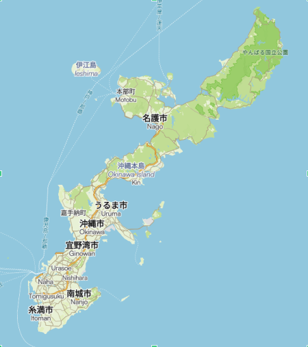

---

{:.float-right}

|-:|
|  🚴: [Strava](https://www.strava.com/activities/16861918300){:target="_blank"} 🎧: [Coulou](https://youtu.be/mfU825Pg9k8?t=3389){:target="_blank"}  |
{:.responsive-table}

|-:|
|  Boxy cars passing on the right, chain spinning, legs waking up: good morning Okinawa!  |
|  Staying on the left side of the road is foreign to me. Not only do I have to look over my right shoulder, I also have to be mindful of turns: left - roll, right - stop. My instincts are useless. But somehow it's not constraining. Okinawa is chill like that.  |
|  Japan is smaller than California. Slightly larger than Germany. Okinawa is one of 426 inhabited islands in the area. And there are anywhere between 3000 and 6852 islands south of the main island. I know that from a book on the [Ryukyu Islands](https://www.amazon.com/Okinawa-Ryukyu-Islands-Comprehensive-Entire/dp/4805312335){:target="_blank"} I was just reading, which was weirdly inspiring. It reminded me of another book: Ostrov Sakhalin. Dry and filled with stats, yet it just flows.  |
{:.responsive-table}

---

|-:|
|  Something to think about, some pedaling to do, Pocari Sweat in my water bottle, it doesn't get better than this. I'm headed up north until I feel it's time to turn back. У самурая нет цели, только путь.  |
{:.responsive-table}

|-:|
|  WIP  |
{:.responsive-table}

|-:|
|  .  |
{:.about_table}

---

|-:|
|  .  |
{:.about_table}

